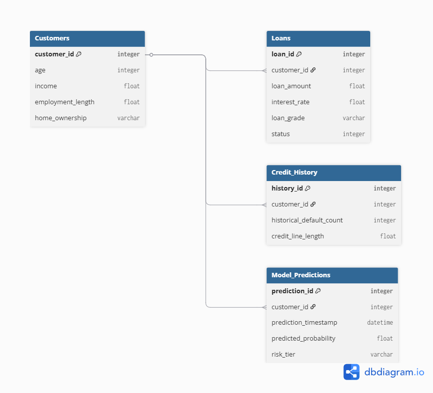

# RiskPulse: End-to-End Credit Risk Pipeline

## Project Overview
RiskPulse is a full-stack data application designed to predict the probability of loan defaults. Moving beyond a simple machine learning script, this project features a fully normalized relational database, automated data quality constraints, and advanced SQL feature engineering to feed an XGBoost prediction model.

The final output is served via an interactive Streamlit dashboard that allows stakeholders to view aggregate portfolio risk and inspect individual customer default probabilities using SHAP explainability.

## Data Architecture & SQL Engineering
To handle data efficiently and mimic a production environment, data is stored in a normalized relational database with strict data quality constraints (e.g., `CHECK (income >= 0)`).

**Key Data Engineering Highlights:**
* **Persistent Storage:** Migrated flat CSV data into a persistent `SQLite` database.
* **Advanced SQL:** Utilized **Common Table Expressions (CTEs)** and **Window Functions** to engineer features directly in the database (e.g., calculating individual income variance against peer averages) to reduce memory load on the application layer.

## Tech Stack
* **Data Engineering & Storage:** SQLite, Advanced SQL (CTEs, Window Functions), Pandas
* **Machine Learning:** XGBoost, scikit-learn, imbalanced-learn (SMOTE), SHAP
* **Backend & Frontend:** Python 3.12, Streamlit
* **DevOps:** Docker, Docker Compose

## Machine Learning Performance
The XGBoost model was trained to handle heavy class imbalances using SMOTE. 
* **ROC-AUC:** 0.765
* **Accuracy (thresh=0.2):** 89%
* **Recall (defaults):** 30%
* **Precision (defaults):** 29%

## How to Run (Docker)
This application is fully containerized. You do not need to install Python or any dependencies locally to run it.